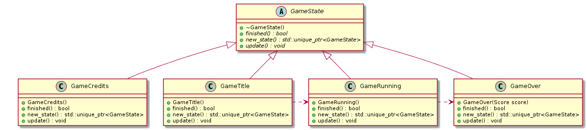
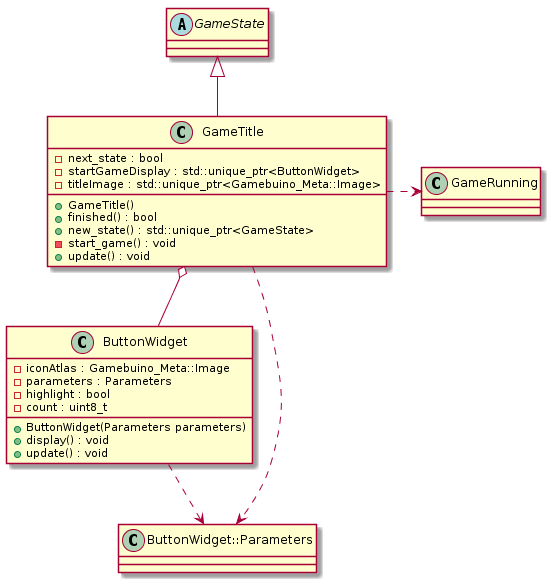
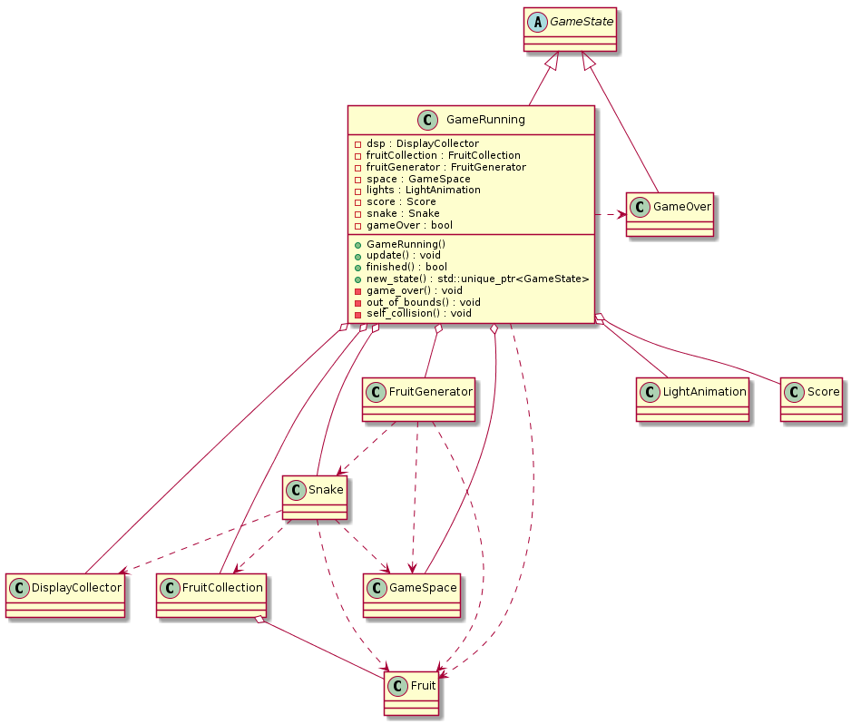
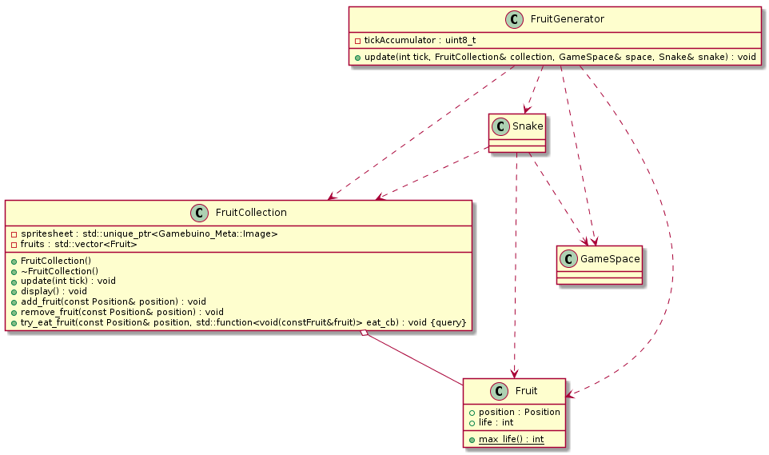
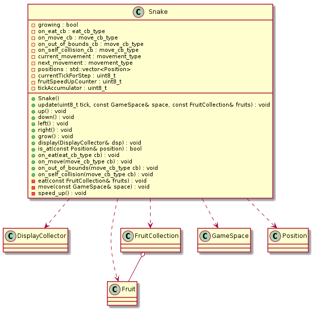

# Code

This document is written to help the curious person to wander into Caterbuino code. It is written as a journey starting with the main file, explaining some design decision (and possible improvements).

## The Start

The first file to look at is `caterbuino.ino`. This file is the only `.ino` file and serves as a jump to the other C++ code while taking advantage of the `setup()/loop()` default system of the *Arduino SDK*.

In the `setup()` function, the *Gamebuino-META* SDK is initialized with a set framerate of 25 FPS, and a `game` is created. This is the only global object, handled by a `unique_ptr`, more on this later.

In the `loop()` function, the *Gamebuino-META* SDK is updated, the the `game` itself is updated.

A block handles a small profiler that will tell you the time taken by the game and the memory left when you press the **B** button.

The at least, if the `game` tells it has finished, then we pass to the new state.

### The profiler

The profiler is a really simple one, it uses two *Gamebuino-META* SDK functions (`gb.getCpuLoad()` and `gb.getFreeRam()`) and displays the results.

It's useful mainly to check if playing the game doesn't lead to memory leaks.

### The GameState

`GameState` is an interface used by every state of the game. Consider a state as a distinct part of the game flow. In Caterbuino, there are three states: the game title, the gameplay part and a game over.

Each state is represented by a class that is in charge of the operations for this particular state, including when it is time to go to the next state.

Every game state as three mandatory methods:

* `update()` is called by the main loop, and is in charge of the operations.
* `finished()` is a boolean function that will be true when the state indicated to the main loop that it's time to change phase.
* `new_state()` is a function to acquire the new state.

These three methods are called in the main `loop()` function.

In the following diagram, you can see the relations between the states (the operating details are not shown). It's missing the dependency the `GameOver` has on `GameTitle`... because I was not able to display it correctly with PlanUML.

To start the game, an initial state must be created. It's what the `create_game()` procedure in `gameinit.cpp/.h` is for.

### GameTitle

The `GameTitle` state is in charge of displaying the GameTitle, the hint that you have to press `A` to start and wait for this button press.

The `update()` method does this by first displaying the title screen, then using a `ButtonWidget` instance to display the button and using the SDK to look at the `A` button status.

If the `A` button is pressed, a flag is raised to trigger the `finished()`/`new_state()` pair, which will create a `GameRunning` instance to give to the main loop.

Really simple class.

### GameRunning

`GameRunning` is the class responsible for tying up the core gameplay. It's dependant on a bit too much other services to my taste. The gameplay is handled through the relations betweem, mainly `Snake`, `GameSpace`, `GruitCollection` and `FruitGenerator`.

In the class constructor, the different services are initialized.

* The `GameSpace` is initialized with the size of the play field.
* A `on_move` callback is passed to the `snake` object to handle what happens when the caterpillar moves.
* A `on_eat` callbacks is passed to the `snake` object to handle what happens when the caterpillar eats a fruit.
* Two callbacks are passed to handle what happens when the caterpillar hits itself or the play field boundary. It has the same effect today, but I had plans where it could lead to different game effects.

*Note*: To avoid capture `this` in the lambda, which is generally a bad idea, the member variable has to be aliased to a local reference variable. That's a bit of unfortunate boilerplate, but I've already been bite capturing `this` more than once.

The `update()` method is basically calling `update()` on all the services that have to be updated, then `display()` on the services that have to display something.

There are two inconsistencies here. First, the `update()`/`display()` is inconsistent through the program. Sometimes, a class does the two operations in a single method, sometimes the update and display operations are separated (which should be the general case).

The other inconcistency it that some `update()` functions take a `tick` value, some not. But the `tick` is always `1`.

When a collision happens, the change of state is triggered and a `GameOver` state is created for the main loop to be used.

### GameOver

The `GameOver` state is the latest of the three states. Its constructor takes a score from the `GameRunning` state, which it will display alongside a small animation of the `Game Over` title, and a sign showing that pressing `A` button is the action now needed (to restard the game).

To avoid pressing the `A` button too soon and not seeing the final score, there's a small delay before taking it into account.

When the button is pressed, the `GameOver` states can give a new `GameTitle` state for use in the main loop.

### Fruits

The fruits are handled by a generator and a collection. The generator creates fruits on the play field, and the collection contains all the current fruits on the play field, which it can display and destroy.

#### `FruitGenerator`

`FruitGenerator` has a frequency of generation. Each time it has to generate a fruit, it asks the `GameSpace` for a random position. If a portion of the snake is at the position, then the fruit is not generated. 

*Note*: if a fruit is already there... well, there are two fruits at the same position, which is not intended (meaning: that's a bug to fix). A generated fruit is added to the collection.

#### `FruitCollection`

`FruitCollection` handles the fruit lifetime and displays them.

*Note*: that should be two different concerns handled by different classes.

The `display()` method draws each fruit depending on its position. If the fruit is about to be removed from the play field, a blinking effect is achieved by displaying the fruit one every other frame.

The `update()` method handles the fruit lifetime. If a fruit lifetime drops to `0`, then it's removed from the collection, and so from play field.

*Note*: in a stricter object oriented design, the lifetime should be handled by the fruits themselves.

The `FruitCollection` also offers a service of trying to eat a fruit. Given a position, if there's a fruit there, a callback will be called.

### Snake

`Snake` is in fact the caterpillar. The project started as a snake game, but when drawing the sprites, I felt it looked more like a caterpillar, so I changed the name of the game, but not the class name.

On `update()`, `Snake` does two things when it's time to move. First it moves, then it eats.

The `move()` private method is in charge of moving the caterpillar and make it grow when it has too. It also detects collisions.

As the positions that take the caterpillar is a vector of positions, moving it is just adding the new position in front and, if the caterpillar didn't grow, removing the last position.

*Note*: some other classical storage of a snake positions is using a ring container rather than a vector. It would handle less memory movement at the cost of a slightly more complex first position handling.

When at maximum size and when it should grow, the caterpillar speeds up by calling the `speed_up()` private method. Speeding up is reducing the number of ticks to wait before a movement is actually done.

*Note*: on a game design side, it's not really satisfactory, because the game can be abused by just never eating fruits. It would be long, but you would have the maximum score. Future version should change this.

The `eat()` method just ask the fruit collection to try to eat a fruit at head's position, giving it the callback to call if there really was a fruit.

The direction methods set the future direction to take on the next movement and forbids the move on the opposite direction directly.

### Caterpillar display

The display for the caterpillar was one of the first class written for the game, with the separation of concern in mind. Thus it's separated from the `Snake` class, which handles gameplay. `Snake` only sends its positions to `DisplayCollector`, which in turns display the caterpillar.

The different drawing of the head, which needs to be drawn in the correct direction, compared to the rest of the body, leads to a nasty state variable `head`, which needs to be reset by the client before beginning the draw.

That's a bit ugly, yes.

### `GameSpace`

`GameSpace` is a simple class that takes care of the play field boundaries. It is also capable of giving a random position which is guaranteed to be inside the play field.

### `LightAnimation`

`LightAnimation` is a small class hardcoding an animation of the console backlights.

### `Score`

`Score` is in charge of incrementing the score until the higher limit, but also to display it.

*Note*: that's the main reason why the score is displayed at the same place during game play and game over screens. Thus demonstrating how not separating the concerns puts pressure on the design.

### Asset data

Every asset in the game is incorporated as static data in direct *Gamebuino-META SDK* format. A function gives access to the raw data.

These files, all starting with `data_`, are generated with the [`SpriteToCode`](https://github.com/Mokona/SpriteToCode) script.
